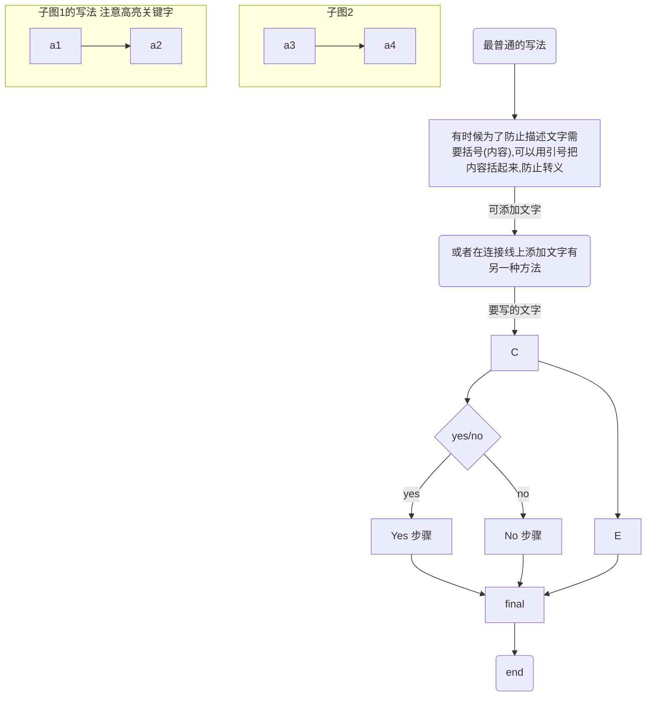
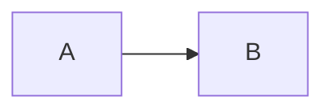

---
YAML FONT Matters 内容
---

目录语法 \[toc]

[TOC]


# 一级标题 标题使用#前缀 或者快捷键花键+1234

## 二级标题 其实写标题的时候,#和要和内容有空格,但是typora软件直接帮着简化处理了

### 介绍基本语法

<u>注意markdown文本中标点符号基本都要英文 中文的输入法会输入中文字符，不方便</u>

这其中换行使用的是shift+enter 
确定一行则是移到最末尾使用enter

<u>下划线
这是 快捷键花键+U</u>

~~删除线~~

**加粗字体**

*斜体*

***斜体加粗***

反斜杠 英文输入法中 和|在一个键位的符号
由于有时候只想打普通符号,因此可以加入反斜杠,防止其输入特殊格式.例如以下是对上标的反斜杠,使其变为普通符号

你好\^hello\^^

> 引用
>
> 你好,引用里面,如果打回车那么就成了两个引用
>
> > 嵌套只能在当前模组下使用

> > 引用嵌套

****

分割线 可以使用三个或三个以上的 *** 或者 ---

----

==高亮==

x^2^ H~2~O


### 下面介绍列表

有序列表和无序列表的区别在于 有序列表使用数字(1234),字母(abcd)或者罗马字符作为列表标序,但是markdown现在只支持1234这种标序. 注意写列表的时候,特殊标识符要和内容有空格来区分

有序列表标示方法 1. 内容  2. 内容      退出列表标示环境,连续按两下空格

1. 有序列表
   + 你好
   + hello
   + 无序(如果要嵌套,这里的方法是shift+enter  之后打上无序列表的标志符 +-* 即可)
2. 有序列表2
3. 有序列表3
   换行

无序列表标识符 + - *  内容    标识符和内容间要留有一个空格

+ 无序列表1
+ 无序列表2
+ 无序列表3

### 介绍图片

示例如下.

格式    ![图片alt] (图片路径 "图片title")

图片alt就是显示在图片下面的文字，相当于对图片内容的解释。
图片title是图片的标题，当鼠标移到图片上时显示的内容。title可加可不加 


网上的图片可能无法装载成功,因此最好保存到本地看


### 超链接

和图片类似 只需要去除前面的!   注意超链接需要按花键+点击
如果直接鼠标点只是修改

[百度markdown超链接](https://www.baidu.com)

<a href="https://www.baidu.com" target="_blank">百度html格式</a>

超链接有两种格式,以上介绍的是内联方式,格式为\[]()
还有一种为引用方式,如下

[Google][] is a good search engine,[baidu][1] is too.
google这个是隐式链接,下面的链接直接用其链接文本本身.
但是这个好像是花里胡哨,不好看

[Google]: http://www.google.com/	"可选输入标题,但好像不会显示"
[1]: http://www.baidu.com	"option title"

 

This is [an example][id] reference-style link.

Then, anywhere in the document, you define your link label like this, on a line by itself:

[id]: http://example.com/  "Optional Title Here"

### 表格

|姓名|年龄|性别|
贾良军|23|男
朱丽嘤|22|女
戴媛媛|22|女

|  姓名  | 年龄 | 性别 |      |
| :----: | :--: | :--: | ---- |
| 贾良军 |  22  |  男  |      |
|        |      |      |      |

| 姓名 | 技能 | 排行 |
| ---- | :--: | ---: |
| 刘备 |  哭  | 大哥 |
| 关羽 |  打  | 二哥 |
| 张飞 |  骂  | 三弟 |

| 姓名   | 年龄 |
| ------ | ---- |
| 贾良军 | 23   |

typora的表格工具 是先输入一个表头,然后按下回车
你需要在生成的表格中编辑
对手打的表格格式好像不太支持 使用花键+/  可查看源代码

### 代码块

代码需要切换到英文输入法 舒服反引号(mac键盘上在esc的正下面)  ``单个反引号扩起来表示一行代码,也可以理解为着重显示.或者使用两个反引号扩起来也一样
而如果输入```+enter 则是表示插入代码段,代码段可以选择语言,从而高亮关键字

`python`

```python
def func(a):
  return a
```

```python
'''
Author :forvpn123
mail   :zhuliying0923@163.com
file serial:EA24L2Y4358XDNJK6GTXUAT
'''
print('hello')
```

### 上下标

先描述一下上下标,这是==Markdown==的拓展语法,需要在设置中开启.高亮也是拓展语法,都在设置一起,高亮则是使用两个== ==括起来
上下标,下标关键标识符为~~ 使用~下标内容~ 来表示
上标关键标识符为^^  使用^上标内容^来表示
举例如下

H~2~O~2~    x^2^y

### 公式编辑

typora支持Latex的公式编辑

行内公式使用\$\$扩起来
行间公式使用\$\$+enter

$a+b=c$
$$
Mathwork*2-1=0
$$


### 流程图

流程图有两种语法
流程图都是放在代码块格式中写的
其中一种格式为flow 另一种格式为mermaid
实际感觉上mermaid语法要简单一些,但是flow资料好像多一些

```flow
st=>start: Start
op=>operation: Your Operation
cond=>condition: Yes or No?
e=>end
st->op->cond
cond(yes)->e
cond(no)->op
```


```flow
st=>start: 注册印象笔记
a=>condition: 是否已经购买马克飞象
b1=>operation: 您已购买马克飞象可以使用markdown语法
c=>end: 欢迎使用马克飞象
b2=>operation: 还未能成功购买马克飞象但你可以免费试用10天
d=>condition: 是否要购买马克飞象
e1=>operation: 您已成功购买马克飞象欢迎使用
e2=>operation: 试用10天后将会到期欢迎购买

st->a
a(yes)->b1->c
a(no)->b2->d
d(yes)->e1->c
d(no)->e2
```




其实也可以插入超链接 资料没找到有点复杂,就先放在这里




关于这个mermaid语法写流程图的教程可参考
[mermaid写流程图教程的博客](https://blog.csdn.net/qq_33022749/article/details/87859348)

hello[^hello]


[^hello]: hi


### 任务列表

这就像一个用于标记自己是否完成的计划一样的列表
使用 行首的 - [ ] 来表示 要注意空格,不然可能写成无序列表

- [ ] **任务1**
  加油
- [ ] **任务2**
  看电影

- [x] **完成任务**
  任务完成

- [ ] a task list item
- [ ] list syntax required
- [ ] normal **formatting**, @mentions, #1234 refs
- [ ] incomplete
- [x] completed

### 脚注

脚注相当于是对于文章的一个注释,就比如写在一句话后面,出现一个^[1]^.<br/>这个上标[1]链接到后文的解释

脚注之间可以相隔的很远,不过这种编辑器显示脚注依然是可以看见的,而且不像word一样每页自动有分隔符线

这是一个链接到谷歌的[^1]。

[^1]: 展示google的url www.google.com

### url地址

可以直接使用<地址>的方式来输入url,或者常规的url也会自动被识别出来

链接到typora官网  <i@typora.io>
www.baidu.com

### 表情

其实表情也是可以输入的

😙

:smile: :smiley: 表情都是使用 :名称: 来表示:sweat:感觉很有意思.
有专门的emoji语法

### enter 和shift+enter 代表的含义

这个搞得不太清楚,明天在琢磨

enter
shift

shitf+enter

### 快捷键

typora和普通的文本编辑器快捷键有点不同

Mac中比如选中单词是 cmd+d 选中以标点或字母为间隔的部分
cmd + -> 和cmd+ <- 代表了光标移至行首行尾
cmd+shitf + ->则是对这一行及其右半部分进行选中
cmd+L则是选中这一行所有的内容

自动拼写检查以及纠错,需要在设置中开启
holidays 

替换快捷键 cmd+h

如果想把一个带格式的文本块转化为普通段落,则使用cmd+数字0

 